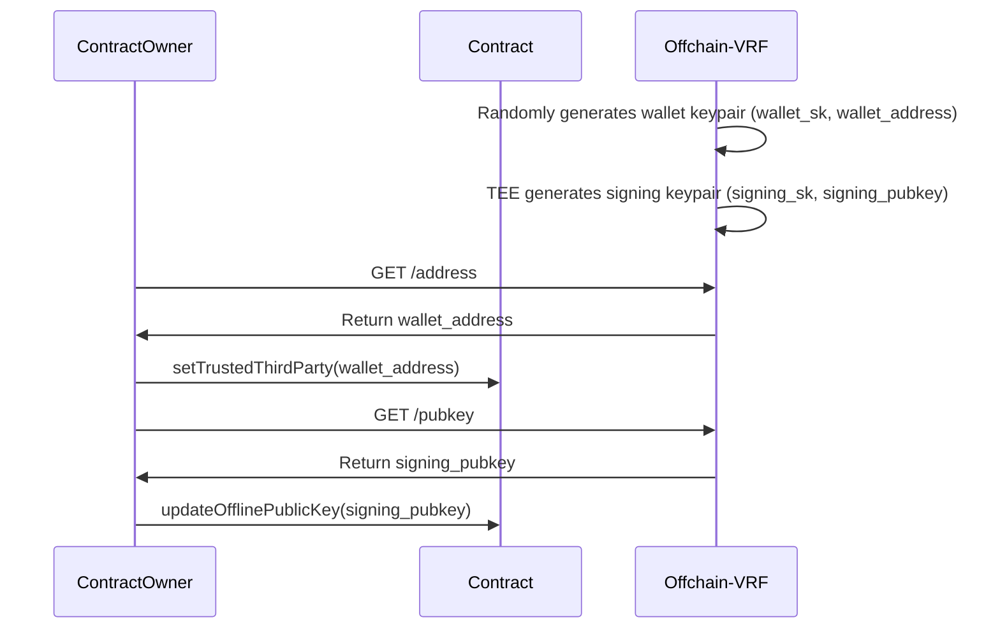
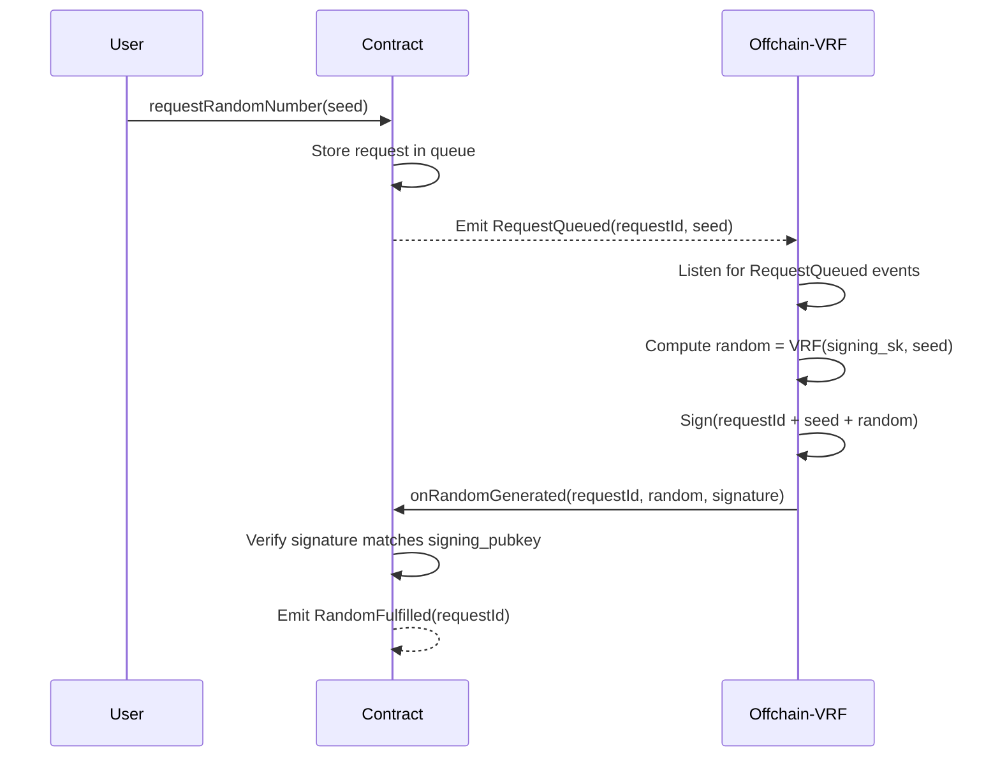

# Phala Cloud VRF 

A Verifiable Random Function (VRF) implementation leveraging Trusted Execution Environment (TEE) technology on [Phala Cloud](https://cloud.phala.network/) and [DStack](https://github.com/dstack-TEE/dstack/). Delivers cryptographically verifiable randomness for Web3 applications with hardware-backed security and unprecedented efficiency.

## Key Advantages 🚀
### 1. **Cryptographically Verifiable Randomness**
- **TEE-Secured Computation**: Generation process uses a signing private key created and stored exclusively within the TEE enclave
- **On-chain Verification**: Every random output is signed by TEE private key, verifiable through the corresponding public key on-chain
- **End-to-End Security**: From secure enclave key generation to Ethereum-native signature validation
### 2. **Blazing Fast Performance**
- **Short Time Finality**: Complete request-to-fulfillment cycle in just 2 blocks (4 seconds) on Base Sepolia
- **Real-Time Responsiveness**: Event-driven architecture ensures sub-second processing latency
### 3. **One-Click Deployment**
- **Phala Cloud Native**: Fully scripted deployment via Docker Compose
- **Cost-Efficient**: Optimized gas usage and TEE resource management
- **Chain-Agnostic**: Modular design supports EVM chains and L2s
### 4. **Production-Ready Infrastructure**
- **Mainnet-Proven**: Audited implementation supporting Base Sepolia & Sepolia testnets
- **Live Demo**: [Video walkthrough](https://drive.google.com/file/d/1bp9ABKSiqz092Jz5e9QzmFlXBF9UEKM_/view?usp=sharing) demonstrating end-to-end workflow

The system comprises:
1. On-chain VRF Coordinator Contract
2. Off-chain VRF Generator (Confidential VM)
3. Client-facing API endpoints

## VRF Workflow

### 1. Initial Setup


- **Trusted Wallet Identity Establishment**
  Offchain-VRF generates `wallet_sk` (private key) and derives `wallet_address`. Contract owner registers this address as trusted via `setTrustedThirdParty()`. And further transactions are sent from this wallet address.

- **OffChain Key Distribution by TEE**
  TEE generates separate `signing_sk` for VRF operations. Contract owner retrieves the corresponding public key via `/pubkey` endpoint and register it on-chain

### 2. Randomness Request Flow


- **Request Initiation**
  Users submit randomness requests with unique seeds via `requestRandomNumber(seed)`

- **TEE Computation**
  Offchain-VRF monitors events and processes queued requests using:
  ```ts
  random = SHA256(signing_sk + seed)
  signature = ethers.Wallet.signMessage(signing_sk, solidityPackedKeccak256(requestId, seed, random))
  ```

- **On-chain Verification**
  Contract verifies using ECDSA recovery:
  ```solidity
  address recovered = ecrecover(hash, v, r, s);
  require(recovered == signing_pubkey, "Invalid signature");
  ```

## Key Features

- **TEE-Backed Security**
  - Secure key generation & storage in enclave
  - Memory encryption and attestation proofs

- **Verifiability**
  - Cryptographic proof of correct computation
  - On-chain signature verification

- **Fault Tolerance**
  - Automatic request retries
  - Transaction nonce management

- **Monitoring**
  - Real-time request tracking via API
  - Event history inspection

## API Endpoints

| Endpoint | Method | Description |
|----------|--------|-------------|
| `/get_wallet` | GET | Returns TEE's operational wallet address |
| `/pubkey` | GET | Retrieves offline public key for VRF verification |

## Development Setup

### Prerequisites
- [Node.js](https://nodejs.org/en) ≥ 18.18
- [Docker](https://www.docker.com/)
- Phala Cloud account

1. Clone repository:
```bash
git clone https://github.com/your-org/phala-cloud-vrf.git
cd phala-cloud-vrf
```

2. Configure environment:
```bash
cp env.local.example .env.local
# Set Ethereum RPC and contract address
```

3. Download and run TEE simulator:
```bash
wget https://github.com/Leechael/tappd-simulator/releases/download/v0.1.4/tappd-simulator-0.1.4-aarch64-apple-darwin.tgz
tar -xvf tappd-simulator-0.1.4-aarch64-apple-darwin.tgz
cd tappd-simulator-0.1.4-aarch64-apple-darwin
./tappd-simulator -l unix:/tmp/tappd.sock
```

4. Docker Compose:
```bash
docker-compose up
```

5. Run tests:
Use the contract address and localhost:3000 and the random seed to run `request.ts` to test the VRF workflow.


## Phala Cloud Deployment
Use `docker-compose.yml` to deploy on Phala Cloud.
Set ENV `RPC_URL` and `CONTRACT_ADDRESS` to setup.
Then use contract address and container network ip and the random seed to run `request.ts` to test the VRF workflow.


## Demo Contract:

You can use the demo contract to test the VRF workflow. The contract is deployed on [Base Sepolia testnet](https://sepolia.basescan.org/address/0x945ac747bc520db5fc39447dfcee302190713825).

You can check the transactions and events on the testnet. The speed of the transactions is fast, it only costs 2 blocks to generate the random number. If you want to test the VRF workflow, you can follow the steps above both on local and on the phala cloud.

Also we have a workflow demo [Video walkthrough](https://drive.google.com/file/d/1bp9ABKSiqz092Jz5e9QzmFlXBF9UEKM_/view?usp=sharing) 
