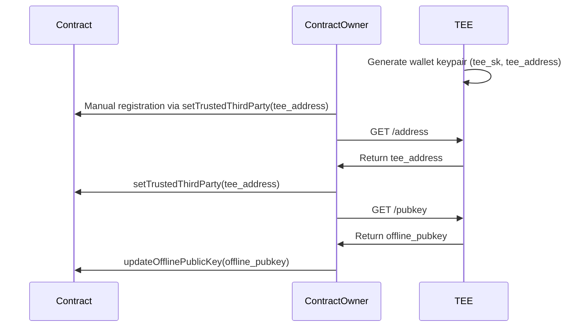
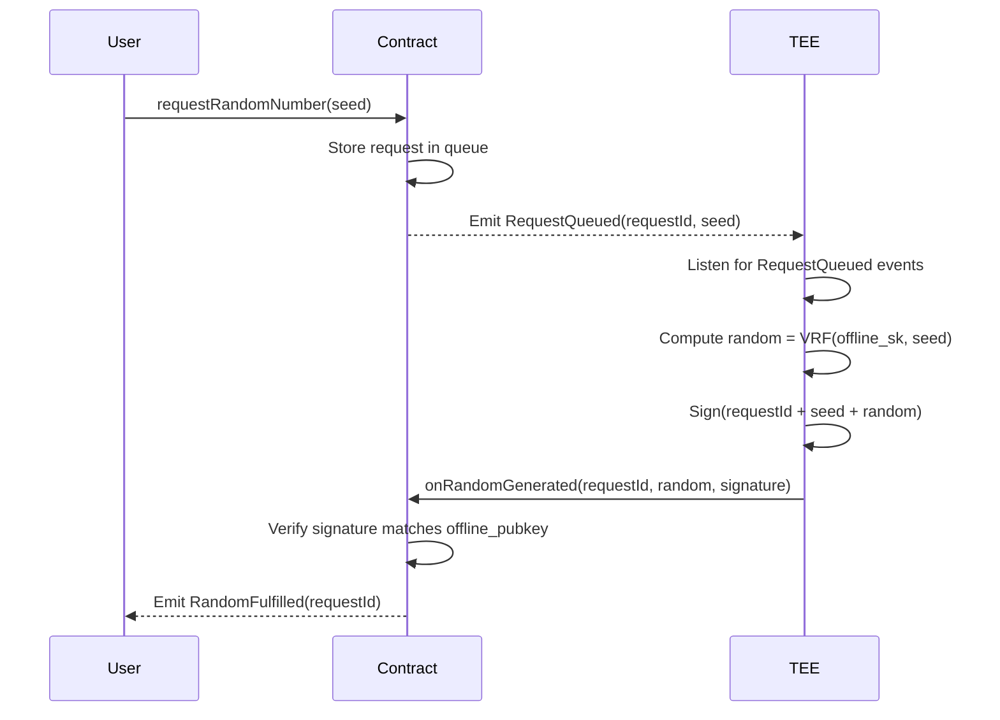

Here's an enhanced README with VRF workflow explanation and technical refinements:

# Phala Cloud VRF 

A Verifiable Random Function (VRF) implementation leveraging Trusted Execution Environment (TEE) technology on [Phala Cloud](https://cloud.phala.network/) and [DStack](https://github.com/dstack-TEE/dstack/). Provides cryptographically verifiable randomness for blockchain applications with enhanced security guarantees through hardware isolation.

## Overview

This implementation combines on-chain smart contracts with off-chain TEE computation to deliver:
- **Tamper-proof randomness generation** - Secure enclave execution prevents manipulation
- **Cryptographic verification** - Elliptic curve signatures prove randomness authenticity
- **Decentralized trust** - Trust anchored in hardware security rather than individual entities

The system comprises:
1. On-chain VRF Coordinator Contract
2. Off-chain TEE Service (Confidential VM)
3. Client-facing API endpoints

## VRF Workflow

### 1. Initial Setup


- **TEE Identity Establishment**
  TEE generates `tee_sk` (private key) and derives `tee_address`. Contract owner registers this address as trusted via `setTrustedThirdParty()`. And further transactions are sent from this address.

- **Offline Key Distribution**
  TEE generates separate `offline_sk` for VRF operations. Contract owner retrieves the corresponding public key via `/pubkey` endpoint and register it on-chain

### 2. Randomness Request Flow


- **Request Initiation**
  Users submit randomness requests with unique seeds via `requestRandomNumber(seed)`

- **TEE Computation**
  TEE monitors events and processes queued requests using:
  ```ts
  random = SHA256(offline_sk + seed)
  signature = ethers.Wallet.signMessage(offline_sk, solidityPackedKeccak256(requestId, seed, random))
  ```

- **On-chain Verification**
  Contract verifies using ECDSA recovery:
  ```solidity
  address recovered = ecrecover(hash, v, r, s);
  require(recovered == offline_pubkey, "Invalid proof");
  ```

## Key Features

- **TEE-Backed Security**
  - Secure key generation & storage in enclave
  - Memory encryption and attestation proofs

- **Verifiability**
  - Cryptographic proof of correct computation
  - On-chain signature verification

- **Fault Tolerance**
  - Automatic request retries
  - Transaction nonce management

- **Monitoring**
  - Real-time request tracking via API
  - Event history inspection

## API Endpoints

| Endpoint | Method | Description |
|----------|--------|-------------|
| `/address` | GET | Returns TEE's operational wallet address |
| `/pubkey` | GET | Retrieves offline public key for VRF verification |
| `/requests` | GET | Lists pending randomness requests |

## Development Setup

### Prerequisites
- [Node.js](https://nodejs.org/en) ≥ 18.18
- [Docker](https://www.docker.com/)
- Phala Cloud account

1. Clone repository:
```bash
git clone https://github.com/your-org/phala-cloud-vrf.git --recursive
cd phala-cloud-vrf
```

2. Configure environment:
```bash
cp env.local.example .env.local
# Set Ethereum RPC and contract address
```

3. Start local simulator:
```bash
git clone --recursive https://github.com/Dstack-TEE/meta-dstack.git
cd meta-dstack/dstack/sdk/simulator
./build.sh && ./dstack-simulator
```

4. Launch service:
```bash
docker-compose up
```